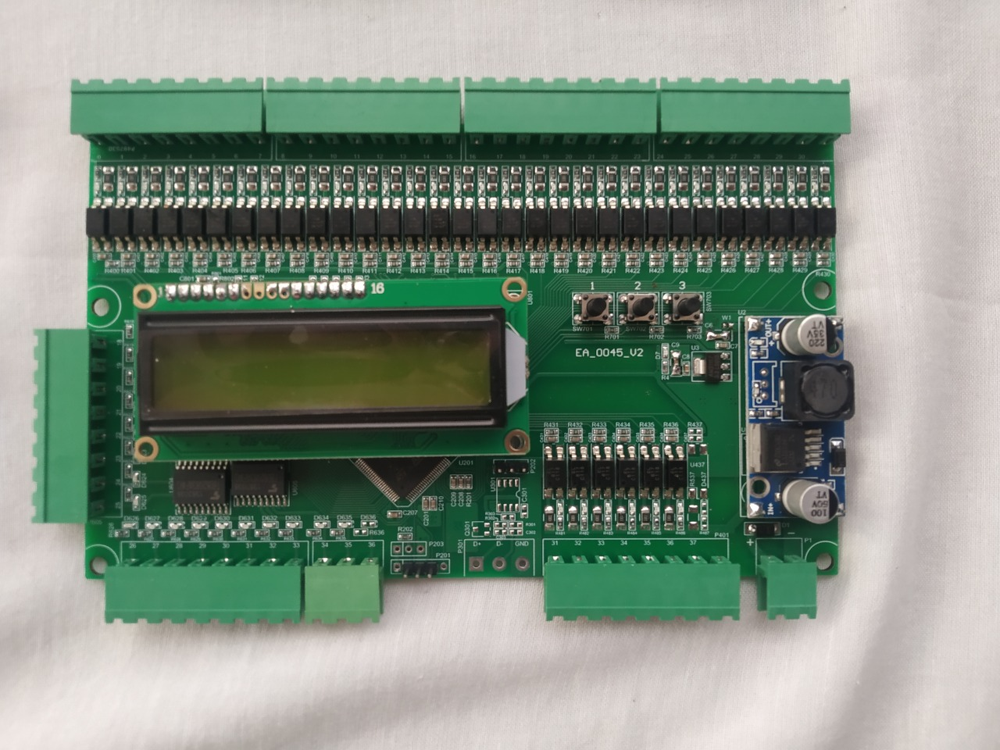
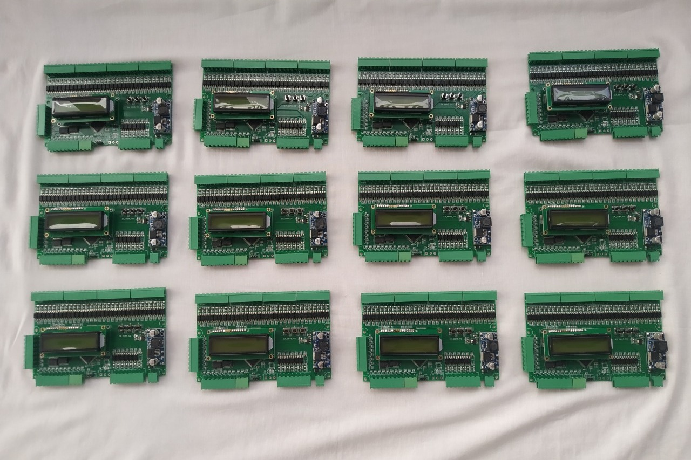
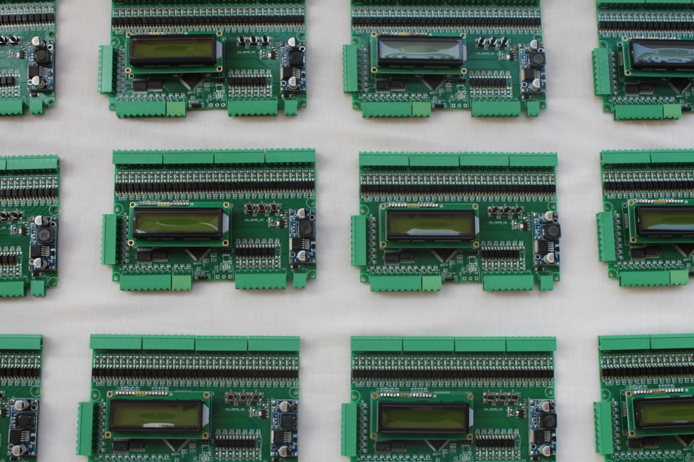

<!--
{}
This is a placeholder page that shows you how to use this template site.
{}
-->

## Specification
* Supply Voltage : 12VDC / 24VDC
* No of Stop: Upto G+7
* Auto Door / Manual Door
* All Reed / Three Reed
* An error are display on LCD display.
* All system parameters can be adjusted by using 3 buttons and LCD placed on the card.
* Call Register LED and Call Push Button are on single wire.
* All the Input and Output are available in both 12VDC and 24VDC.
* All the Input and Output are carrying LED indication on board.
* Each floor can be named by an alphanumeric character (L, C, P, b, t, G, 0, 1, 2, 3.....).
* All pin can be re-configure to any other pin on site.
* UPS function.
* Hydraulic lift support.

## Documents

Open a <a href="ELEVATOR-UNIVERSAL-CONTROLLER.pdf"  target="_blank">Elevator Controller Wiring Detail</a>

## Product Images

---